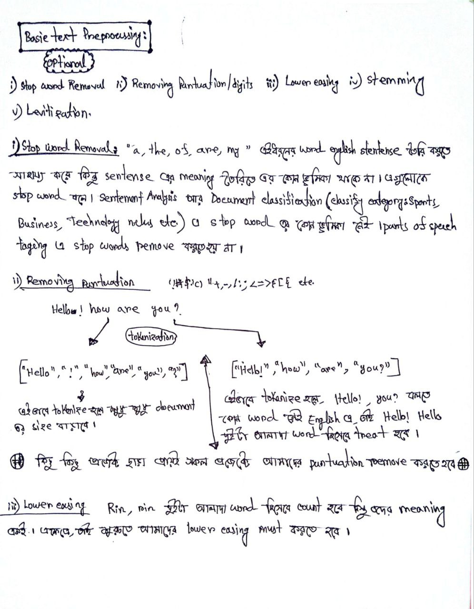

# Topics:

- What is NLP?
- Real World Applications of NLP.
- Common NLP Tasks
- Approaches in NLP
- NLP Pipeline 
- Text Preparation

 

# `#01 What is NLP:`

 
Natural language processing is a subfield of linguistics,computer science and artificial intelligence concerned with the interactions between computers and human language, inparticular how to progrma computer to process and analyze large amounts of natural language data.

 

`NLP, Natural Language Processing, Natural Language হলো মানুষ কীভাবে কথা বলে, কীভাবে ভাবের আদান-প্রদান করে । Natural Language processing হলো linguistics, AI and Comupter Science এর part যেইটা মানুষের সাথে computer কীভাবে natural language মাধ্যমে operate করা যায় সেইটা নিয়ে কাজ করে ।`

 

# `#02 Real World Applicaitons:`

 

- Contextual Advertisements  
- Email Clients - spam filtering,smart reply  
- Social Media - removing adult content, opinion mining  
- Search Engines  
- Chatbots 

 

# `#03 Common NLP Tasks:`

 

- Text/Document Classification
- Sentiment Analysis
- Information Retrieval **(RAG type application)**.
- Parts of Speech Tagging **(find noun,verb,adjective)**.
- Machine Translation or language translation
- Conversational Agents
- Knowledge Graph **(use in google search)**
- Text summarization
- Text generation or next word predictor
- Speech to Text

 

# `#04 Approaches in NLP:`

 

- **1. Heuristic Method.**
- **2. Machine learning Based.**
- **3. Deep learning Based.**
 

## **1. Heuristic Method: (Rule-Based Approach)**  
### **বৈশিষ্ট্য:**  
- ভাষার ব্যাকরণ, নিয়ম (রুলস) এবং অভিধান ব্যবহার করে তৈরি করা হতো।  
- প্রোগ্রামার বা ভাষাবিদদের দ্বারা ম্যানুয়ালি নিয়ম ডিজাইন করতে হতো।  
### **Era:**  
১৯৬০–১৯৯০ সাল পর্যন্ত (মেশিন লার্নিং আসার আগে)।  
### **উদাহরণ:**  
- **ELIZA (১৯৬৬):** প্রথম চ্যাটবট, সাইকোথেরাপি সিমুলেট করত (যেমন: "Tell me more about your family")।  
- **গ্রামার চেকার:** "He go to school" → "go" কে "goes" করতে বলত (ব্যাকরণ রুল ম্যাচ করে)।  
- **স্ট্রিং ম্যাচিং:** যেমন, "ঢাকা থেকে চট্টগ্রাম যাওয়ার বাস?" → "ঢাকা" এবং "চট্টগ্রাম" শব্দ ম্যাচ করে উত্তর দেয়া।  
### **সীমাবদ্ধতা:**  
- নতুন বাক্য বা শব্দ এলেই কাজ করত না।  
- প্রতিটি ভাষার জন্য আলাদা নিয়ম বানাতে হতো।  

## **2. Machine learning Based:(Statistical Approach)**  
### **বৈশিষ্ট্য:**  
-  Uses statistical models trained on data (e.g., Naïve Bayes, SVM, HMMs) for tasks like classification or sequence labeling.
- **Feature Engineering:** প্রয়োজন হতো (যেমন: শব্দের পজিশন, পার্ট-অফ-স্পিচ)।  
### **Era:** ১৯৯০–২০১০ সাল (ডিপ লার্নিং আসার আগে)।  
### **উদাহরণ:**  
- **Statistical Machine Translation (SMT):**  
  - গুগল ট্রান্সলেট (২০০৬–২০১৬) "Phrase-Based SMT" ব্যবহার করত।  
  - বাংলা → ইংরেজি অনুবাদে শব্দের সম্ভাব্যতা (Probability) হিসাব করত।  
- **স্প্যাম ফিল্টার:** Naïve Bayes অ্যালগরিদম ব্যবহার করে ইমেইল ক্লাসিফাই করা।  
- **পার্ট-অফ-স্পিচ ট্যাগিং:** Hidden Markov Model (HMM) ব্যবহার করে শব্দের ট্যাগ (যেমন: noun, verb) বের করা।  

## **3. Deep learning Based:(Neural Approach)**  
### **বৈশিষ্ট্য:**  
- নিউরাল নেটওয়ার্ক (RNN, Transformer) ব্যবহার করে অটোমেটিক শেখে।  
- **ফিচার ইঞ্জিনিয়ারিং** দরকার হয় না—মডেল নিজে থেকে শিখে নেয়!  
### **Era:**  
২০১০–বর্তমান (এখনকার সবচেয়ে এডভান্সড পদ্ধতি)।  
### **উদাহরণ:**  
- **ওয়ার্ড এম্বেডিং (Word2Vec, GloVe):**  
  - শব্দের ভেক্টর রিপ্রেজেন্টেশন (যেমন: "রাজা - পুরুষ + মহিলা = রানি")।  
- **সিকোয়েন্স-টু-সিকোয়েন্স (Seq2Seq):**  
  - RNN/LSTM ব্যবহার করে মেশিন ট্রান্সলেশন (যেমন: Google Neural MT, ২০১৬)।  
- **ট্রান্সফরমার মডেল (BERT, GPT):**  
  - চ্যাটজিপিটি (GPT-৩/৪), গুগলের BERT—এগুলো এখন সবচেয়ে পাওয়ারফুল।  
### **বিশেষ সুবিধা:**  
- কনটেক্স্ট বুঝতে পারে (যেমন: "বাঁশ" বলতে গাছ না বাঁশি বোঝাচ্ছে?)।  
- একই মডেল দিয়ে অনেক টাস্ক করা যায় (মাল্টি-টাস্ক লার্নিং)।  

 

---

---

---

 

# `#05 What is NLP Pipeline?`

 

NLP is a set of steps followed to build an end to end NLP software.

**NLP software consists of the following steps:**
- Data Acquisition: **(Gather data)**
- Text Preparation: **(Remove emoji,html tag etc.)**
    - Text Cleaning.
    - Basic text preprocessing.
    - Advance text preprocessing.
- Feature Engineering or Text Vectorization.
- Modelling
    - Model Building
    - Evaluation
- Deployment

 

# `#06 Text Preparation:`
 

 

### **Why tokenization is important?**
$20 এখানে, $ আর 20  আলাদা আলাদা হতে হবে ।   
10KM এখানে, 10 and KM আলাদা আলাদা হতে হবে ।   
New-Work এখানে, 'New-Work'একসাথে, New Delhi, "New Delhi" একসাথে থাকবে ।  

**কেন tokenization important?**
আমরা উপরে যে, example গুলো দেখলাম । আমরা যখন একটা chatbot বা nlp related কোন কাজ করবো তখন আমাদের programmer এর knowledge এ থাকতে হবে যে, উপরের word গুলো এইভাবেই করতে হবে । না হলে, আমার chatbot ভালো কাজ করবে না । user কি প্রশ্ন করছে? বা কোন কিছুর উত্তর চাইছে । বা, আমরা যখন model train করবো তখন আমাদের তো resource এর একটা limitation থাকবে  । ভালো gpu থাকবে না, আমরা যদি নিজেদের ইচ্ছা মতো token number বাড়ায় তাহলে তো আমাদের resouce নিয়ে ঝামেলা হবে । তাই, tokenization সময় duplicated words, lemmitation এর word এর ভিন্ন ভিন্ন form like in english we have, preasent,past,futeure, gerund etc. তাই, tokenization হলো একটা গুরুত্বপূর্ণ part NLP application এর জন্য । 

### **Sub-Word Tokenization: Used in LLM's:**

`আমাদের কাছে যে input sentence গুলো থাকবে সেইগুলোকে ভাগ করা । যদি আমাদের কাছে ৪টা থাকে আর যদি আমরা একে ২ টা sentence এ merge করি তখন সেইটা আমরা Sentence Tokenization বলি । আর যদি আমরা word গুলো অনুযাইয়ী ভাগ করি তখন সেইটাকে আমরা Word Tokenization বলি। তেমন ভাবেঃ sub-word(নিচের example), character tokenization হতে পারে । আমরা আমাদের নিজেদের মতো, Tokenization technique Define করতে পারি ।  `

**For example:** `the word "unbelievable" might be broken down into the sub-words "un," "believe," and "able." This helps the model process a larger vocabulary of words.`  

`শুরুতে, openAi যখন, character based Tokenization Technique ব্যবহার করেছে, তখন তাদের Corpus এ unique word সংখ্যা অনেক গুলো হয়েছে । এত গুলো word এর Embedding বের করা সহজ ছিল না । এছাড়া যদি এমন কোন word যেইটা openAi এর traning সময় আসেনি কিন্তু, model এর inference এর সময়ে এসেছে তখন সেইটা OOV(out of Vocuvulary) error দিবে । এজন্য openAi তাঁদের sub-word tokenization technique ব্যবহার করেছে । "university" -> "uni" and "versity." এইভাবে sub-word tokenization ব্যবহার করার ফলে কোন এক সময়ে "uni" "versity" traning এর সময় embedding তৈরি হওয়ার সম্ভবনা অনেক বেশি থাকে ।   `

`Some of the popular subword tokenization algorithms are **WordPiece, Byte-Pair Encoding (BPE), Unigram, and SentencePiece.** .BPE is used in language models like GPT-2, RoBERTa, XLM, FlauBERT, etc. A few of these models use space tokenization as the pre-tokenization method while a few use more advanced pre-tokenization methods provided by Moses, spaCY, ftfy.`  

- `Sub-word Tokenization Tenique এর মধ্যে OpenAi -> BPE(Byte-Pair Encoding) অন্যদিকে google Sentence Piece ব্যবহার করে । `

`** BPE Sub-Word Tokenization এর মধ্যে  পড়লেও । এখানে, word কে subword এ ভাগ না করে openAI, এই Sub-Word Tokenization কে  একটু modify করেছে ।  but, ultemitely, Tokenization এর কোন নিয়ম নেই । একটা, company কীভাবে তার word কে tokenization করবে সেইটা তার উপর নির্ভর করে । **`

 

## `**Byte-Pair Encoding (BPE)**`  

BPE is a simple form of data compression algorithm in which the most common pair of consecutive bytes of data is replaced with a byte that does not occur in that data. It was first described in the article “A New Algorithm for Data Compression” published in 1994. The below example will explain BPE and has been taken from Wikipedia. 

`Suppose we have data aaabdaaabac which needs to be encoded (compressed). The byte pair aa occurs most often, so we will replace it with Z as Z does not occur in our data. So we now have ZabdZabac where Z = aa. The next common byte pair is ab so let’s replace it with Y. We now have ZYdZYac where Z = aa and Y = ab. The only byte pair left is ac which appears as just one so we will not encode it. We can use recursive byte pair encoding to encode ZY as X. Our data has now transformed into XdXac where X = ZY, Y = ab, and Z = aa. It cannot be further compressed as there are no byte pairs appearing more than once. We decompress the data by performing replacements in reverse order.`  

### `Another Example: `
**Imagine you have a text document containing the following sentences:** 

"The quick brown fox jumps over the lazy dog." 

**You want to compress this text using BPE.**  

- Identify Repeated Byte Pairs: 
Look for repeated pairs of characters in the text. In our example, let's say the most common repeated pair is "th". 

- Replace Repeated Byte Pairs: 
Replace the most common repeated pair with a new symbol that doesn't exist in the text. Let's use `"$" for "th"`. So, our compressed text becomes: 

"The quick brown fox jumps over $e lazy dog." 

- Repeat the Process: 
Continue identifying and replacing repeated pairs of characters in the compressed text. Let's say the next most common pair is `"er"`. Replace it with another new symbol, let's use `"#" for "er"`. So, our compressed text becomes: 

"The quick brown fox jumps ov# $e lazy dog." 

- Repeat Until No More Replacements Can Be Made:
Keep repeating the process until no more repeated pairs of characters can be found. In our example, there are no more repeated pairs. 

- **Decompression:**  
To decompress the text, reverse the replacements. Replace the symbols with their corresponding original pairs of characters. For example, replace "$" with "th" and "#" with "er". So, our decompressed text becomes: 

"The quick brown fox jumps over the lazy dog."  

A variant of this is used in NLP. Let us understand the NLP version of it together. 🤗 

BPE ensures that the most common words are represented in the vocabulary as a single token while the rare words are broken down into two or more subword tokens and this is in agreement with what a subword-based tokenization algorithm does.

 

 

