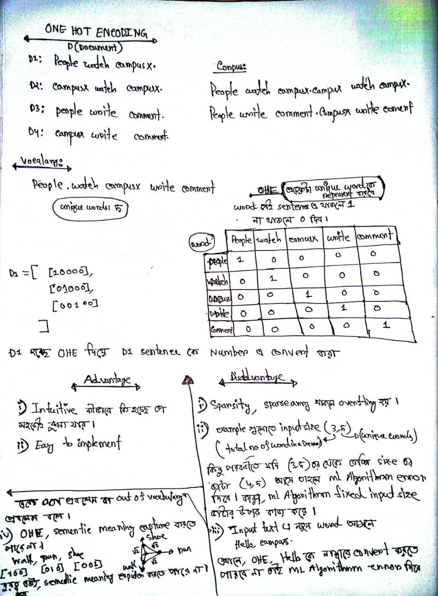
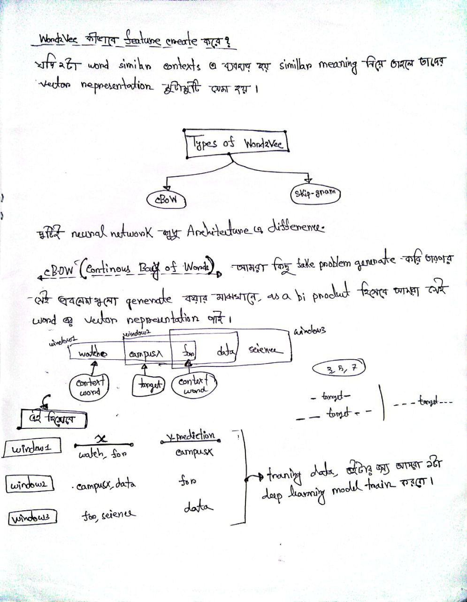

# `#01 Common Terms:`
- Corpus
- Vocabulary
- Document
- Word

### **Key NLP Terms Explained in Simple English**  

#### **1. Corpus**  
- **Definition:** A large, structured collection of **text data** (books, articles, conversations, etc.) used for linguistic analysis or training NLP models.  
- **Example:**  
  - *Bengali Corpus:* "Bangladeshi Constitution, newspaper articles, poems."  
  - *English Corpus:* "Wikipedia pages, Twitter tweets."  

#### **2. Vocabulary**  
- **Definition:** The set of **all unique words** present in a corpus or dataset.  
- **Example:**  
  - Sentence: *"I love NLP, do you love it too?"*  
  - Vocabulary: `{"I", "love", "NLP", "do", "you", "it", "too"}`.  

#### **3. Document**  
- **Definition:** A **single text unit** within a corpus (e.g., a sentence, paragraph, or full article).  
- **Example:**  
  - *"The quick brown fox jumps."* (1 document).  

#### **4. Word**  
- **Definition:** Words in a document.

 
 

# `#02 Self Attention: Part-01 (This is my lecture no:72 in DL Github Repo):`

 
 

` যে কোন NLP Task Complete করার জন্য জন্য সবচেয়ে গুরুত্বপূর্ণ কাজ কি ?  `
- Ans হচ্ছেঃ Word কে Number এ convert করা । শুরুতে, `OHE` এর পর  `Bag of words, Bag of N-gram`  এই সব গুলো `(ml based)` এগুলো আসার পরে, `Word to vec (dl based)` আসে ।  । নিচের নোট গুলোর ছবি দেওয়া আছে রিভিশন করে নাও । 

 

 

# `# 1. ONE HOT ENCODING AND BAG OF N GRAMS: `

 

 

# `# 2. BAG OF WORDS & BAG OF N_GRAMS: `

 

 

# `# 3. TF_IDF: `

 

 

 

 

# `# 4. Word TO VEC: `

 

 

 

 

 

 
 

## `Problem With Word Embedding  `

 
 

- `Word Embedding capture average meaning `

`ধরি একটা corpus আছে যেখানে, উপরের ছবিতে থাকা ৪ টা লাইন আছে । যেখানে, প্রথম তিনটা লাইনে apple fruits  হিসেবে বাকি একটা apple technology(কোম্পানি) ব্যবহৃত হয়েছে । embedding    [x y] যেখানে, x = (apple as a fruits),  y = (apple as a technology)  হলে, আমাদের corpus এ apple fruits  হিসেবে ব্যবহৃত হয়েছে তার documnet সংখ্যা বেশি । তাই, embedding টা      [0.9 0.3] হিসেবে ব্যবহৃত হয়েছে । যেহেতু, apple fruits হিসেবে  ব্যবহৃত হয়েছে তার documnet সংখ্যা বেশি তাই, x component বা x এর value বেশি হবে ।    `

`যদি এমন কোন sentence থাকে (Apple launched a new phone while i was eating a apple) যার  word meaning আমরা বের করবো সেক্ষেত্রে, Wording embedding static (একবার embedding vector তৈরি হয়ে সেইটা বার বার ব্যবহৃত হয়)  হওয়ার  কারণে,  আগে word embedding এর embedding vector, apple এর জন্য [0.9 0.3] ছিল । তাই, এখানে, দুইটা apple এর মিনিং , x = (apple as a fruits) হিসেবে গণ্য করবে । এই সমস্যা থেকে বের হওয়ার জন্য আমাদের একটা dynamic contextual word embedding technique দরকার । যেইটা context অনুযায়ী তার embedding vector change করতে পারবে । আর আমাদের সেই contextual word embedding technique হচ্ছে, Self Attention । অর্থাৎ, উপরের sentence (Apple launched a new phone while i was eating a apple) এর ক্ষেত্রে Self Attention দুইটা Apple এর meaning দুই রকম ধরবে, অর্থাৎ, খাবার , আর technology কোম্পানি দুইটা পাবো  ।   `

